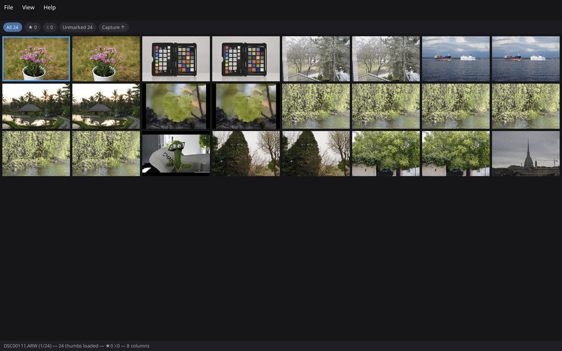
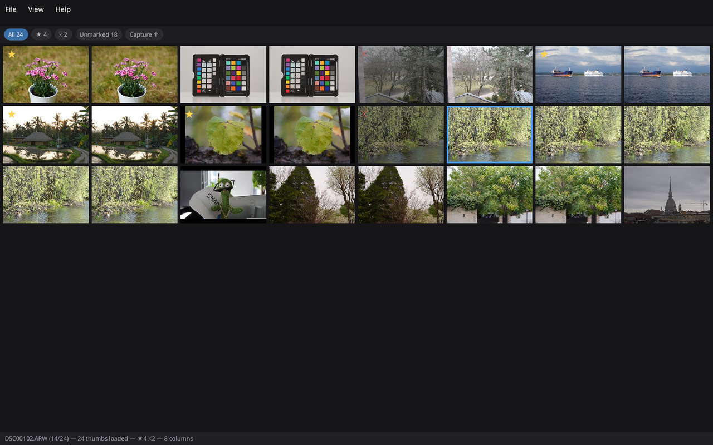
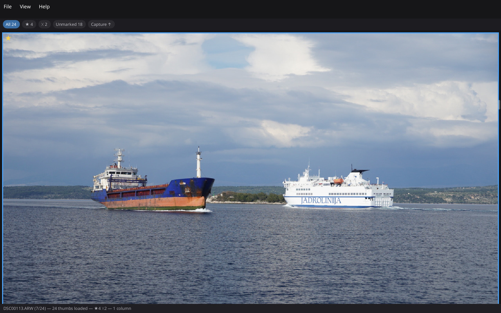
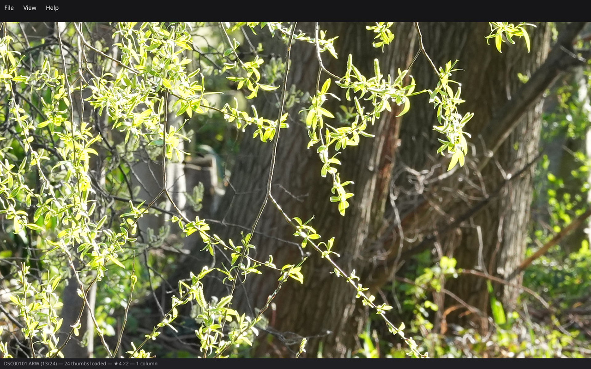

# FastCull

**Cull thousands of RAW photos at the speed you can think.**

FastCull is a fast, keyboard-first, catalog-free culling tool for Linux and
Windows. Point it at a folder of RAW files and thumbnails appear near-instantly —
no import step, no database, no waiting. Fly through the shoot with the keyboard,
pick the keepers, reject the misses, tag the picks with IPTC metadata, and copy
them to a selects folder with every file checksum-verified. Then open them in
[darktable](https://www.darktable.org/) (or Lightroom, or digiKam) and everything
you marked is already there.

Your RAW files are **never modified**. Not once, not ever. Everything FastCull
writes goes into industry-standard XMP sidecar files next to your images.

## What it looks like



A culling pass in six beats: open a folder, mark picks and rejects from the
keyboard, check a frame in the loupe, punch in to 1:1.



The grid mid-cull: star and X badges on marked frames, live pick/reject/unmarked
counts in the filter bar.



The loupe fit view — one keystroke from the grid, rendered from the camera's
embedded JPEG.



1:1 on a 50 MP A1 file: chrome drops away, pixels only.

The screenshots show real RAW files: Sony sample shots from
[raw.pixls.us](https://raw.pixls.us/), all published there under
[CC0](https://creativecommons.org/publicdomain/zero/1.0/) (public domain).

## Why it's so fast

FastCull borrows the idea that made Photo Mechanic legendary: **never decode RAW
sensor data while you're looking at pictures.** Every modern camera embeds
ready-made JPEG previews inside each RAW file — a Sony A1 ARW, for example,
carries both a grid-sized preview and a full-resolution 8640×5760 JPEG. FastCull
reads only those bytes (about 0.5 MB out of a 100 MB file for a thumbnail) and
decodes them on every core you have.

The result, measured on real Sony A1 files: **~300 files/second** through the
thumbnail pipeline on a 32-thread machine, versus roughly one second *per file*
for a full RAW decode. Slow SD cards and network shares are handled with adaptive
I/O, so culling straight off the card mount works too.

## What it does

- **Catalog-free** — open a folder, cull, done. Nothing to import, nothing to
  clean up afterwards.
- **One continuous zoom** — from a 12-column grid down to a single-image loupe
  and a center-anchored 1:1 pixel view, all on the same two keys.
- **Keyboard-first culling** — pick, reject, or clear with single keys;
  marking auto-advances to the next frame so your hands never leave home row.
- **Filter and sort** — one keypress-away chips for picked / rejected /
  unmarked (with live counts), sorted by capture time or filename.
- **IPTC metadata** — caption, keywords, and more, applied to one image or a
  multi-selection, with saved templates and variables like `{date}` and `{seq}`.
- **Copy Picks** — copy your keepers (and their sidecars) to a destination
  folder, with rename templates and **BLAKE3 checksum verification** on every
  file — the green light you want before formatting a card.
- **Sidecar-only writes** — all state lives in `<name>.<ext>.xmp` files using
  the fields darktable, digiKam, and Lightroom read. RAW files stay untouched.

FastCull deliberately does *not* develop or edit RAWs — that's darktable's job.
It does one thing: get you from a full card to a tagged, verified selects folder
as fast as possible.

## Getting FastCull

FastCull is pre-1.0 and there are no packaged releases yet — but you can try it
today.

**Windows** — a ready-to-run test build is attached to every green CI run: grab
the `fastcull-windows-x64` artifact from the
[**Actions** tab](https://github.com/danilocesar/fastcull/actions) (you'll
need to be signed in to GitHub). Details, including the one-time SmartScreen
prompt, are in [RELEASING.md](RELEASING.md).

**Linux** — build from source with a standard Rust toolchain
([rustup](https://rustup.rs/)):

```sh
# dev packages needed: fontconfig, libxkbcommon, wayland, and mesa
cargo build --release
./target/release/fastcull-app /path/to/your/photos
```

## Your first five minutes

Open a folder and keep your hands on the keyboard — that's the whole trick.

| Key | Action |
|---|---|
| Arrows / PgUp / PgDn / Home / End | move around |
| `Y`, `P` or `Space` | pick — and auto-advance to the next frame |
| `N` or `X` | reject — and auto-advance |
| `U` | clear a mark |
| `+` / `-` | zoom: grid columns → loupe → gently up to 1:1 |
| `Z` | jump straight between fit and 1:1 |
| `G` or `Esc` | back to the grid |
| `I` / `K` | IPTC panel / jump to the keyword field |
| `Ctrl+A`, Shift+arrows | select many images at once |
| `Ctrl+E` | Copy Picks… |

That's the short list. The full map lives in the app under
**Help → Keyboard Shortcuts** and in the
[grid & loupe spec](specs/modules/ui-grid.md).

A typical evening: open the folder → `+`/`-` to a comfortable grid → `Y`/`N`
through the shoot (drop to 1:1 with `Z` when focus is in doubt) → filter to
*Unmarked* and empty it → filter to *Picked*, `Ctrl+A`, apply an IPTC template →
`Ctrl+E`, copy to the selects folder, wait for "all checksums verified" → done.

## Plays well with darktable & friends

Pick states and IPTC metadata are written as darktable-compatible XMP sidecars —
and that's not an aspiration, it's a test: FastCull's sidecars are round-trip
verified against a real darktable in the test suite. Lightroom and digiKam read
the same fields. Cull in FastCull, edit wherever you like.

## Camera support

The **Sony A1** is the reference camera — 100% supported and enforced by tests
against real files in all three ARW variants. Any other camera supported by
[rawler](https://github.com/dnglab/dnglab) should work through its embedded
previews on a best-effort basis. If your camera misbehaves, please
[open an issue](https://github.com/danilocesar/fastcull/issues) — sample files
make fixes fast.

## Project status

FastCull is **pre-1.0 and under heavy development** — the core workflow (open →
cull → tag → copy with verification) is in place, with Copy Picks as the most
recent addition. Expect rough edges and rapid change. The roadmap lives in
[specs/milestones.md](specs/milestones.md).

## Learn more

- **[specs/](specs/)** — the full design documentation. This project is
  developed spec-first, so the specs are current, detailed, and the source of
  truth for every behavior.
- **User guide** — a plain-Markdown usage guide under `docs/` is planned for
  the 1.0 release
  ([issue #9](https://github.com/danilocesar/fastcull/issues/9)).

## Contributing & feedback

Bug reports, camera samples, and workflow feedback are all welcome — please
[open an issue](https://github.com/danilocesar/fastcull/issues). If you'd like
to contribute code: this is a spec-driven
repository, so start by reading the relevant `specs/modules/*.md` — changes are
expected to keep code and spec in agreement. Release and Windows-testing
procedures for maintainers are in [RELEASING.md](RELEASING.md).

## License

FastCull's source code is licensed **GPL-3.0-or-later** — see
[LICENSE](LICENSE). Published binaries link [Slint](https://slint.dev/) (GPL-3.0
only), so a distributed FastCull executable as a whole is conveyed under GPLv3;
"or later" applies to this project's own source. Bundled third-party crate
licenses are collected in
[THIRD-PARTY-LICENSES.md](THIRD-PARTY-LICENSES.md), which ships with every
build.

This software is based in part on the work of the Independent JPEG Group.
